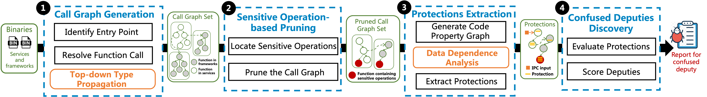
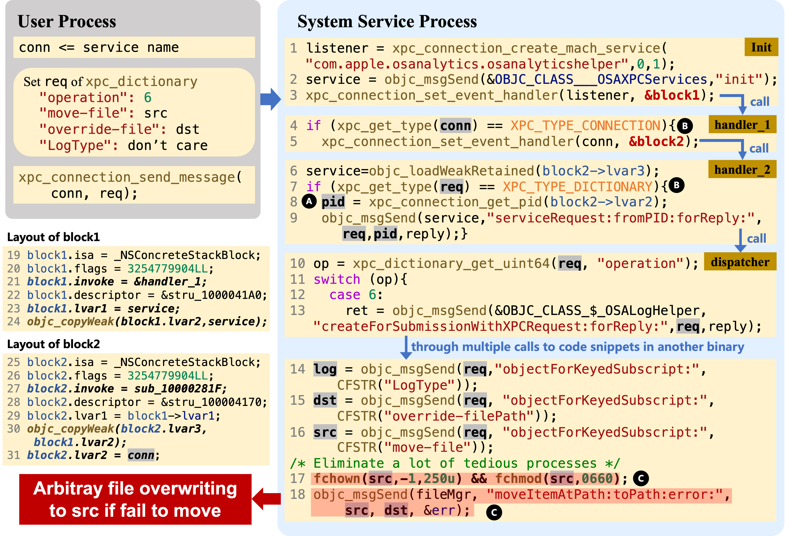
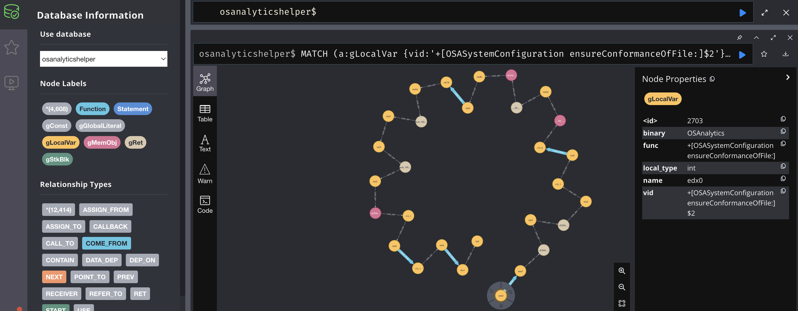
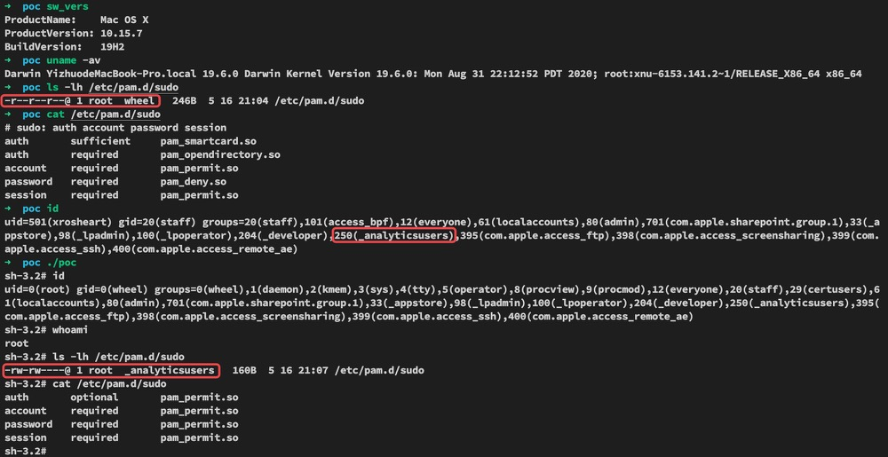

# iService

## Overview

iService is a static analysis framework to detect confused deputies in system services in AppleOS. Specifically, It resolves Objective-C Messages using the top-down type propagation and performs data dependence analysis to identify input validations of sensitive operations. iService discovered 11 confused deputies, of which 5 were 0-day bugs with CVE numbers assigned.



As a static analysis framework, iService can also analyze other binaries written in Objective-C. For example, it can perform taint analysis for iOS Apps after modifying and extending detection policies.

The paper **"iService: Detecting and Evaluating the Impact of Confused Deputy Problem in AppleOS"** is published on [ACSAC'22](https://www.acsac.org/2022/program/final/s327.html).

## Usage

### Requirement

1. IDA Pro 7.4+ with Hexray, therefore *Microcode* (i.e., the IR of IDA) is valid
2. Python 3.6+ with packages in `src/requirement.txt`
3. Docker to deploy databases, details according to `db/docker-compose.yml`
4. Node.js for parallel running `parallel/work.js`

To set up the environment, run the following commands:

1. `cd src` and run `pip3 install -r requirements.txt` to install the packages required for python3
2. `cd db` and run `docker-compose up -d` to start the databases.

Note: in the paper, we use IDA 7.5 and Python 3.8.

### Structure of implementation

The implementation of iService (i.e., `iService/src`) contains the following parts:

* **rules**: Records pre-defined information in `yaml`, such as sensitive operations and their key parameters.
* **libs**: Implement functions required for further analysis, such as generating IDA Microcodes, and encoding and decoding dataflow summaries.
* **models**: Define models for Code Property Graph (CPG) in Neo4j and metadata in SQL, and transform binary analysis result into databases.
* **visitors**: Implement several visitors to parse Microcode.
* **entries**: Identify XPC and NSXPC entry points in services.
* **sinks**: Locate sensitive operations in CPG.
* `intra_procedural.py`: Perform intra-procedural analysis based on visitors.
* `inter_procedural.py`: Perform inter-procedural analysis based on the above files.
* `record.py`: Build CPG in Neo4j graph database, and connect dataflow for further analysis.

The following three files are used to run iService: 
* **`parse.py`**: Parse binaries of services and frameworks, then dump analysis results in Pickle format
* **`commit.py`**: Commit analysis results into Neo4j database and build CPG in it.
* **`check.py`**: Extract permission checks and input validations based on database queries.

We also provide a test case in `iService/cases/10.15.7`. You'd better put your target files in such structure folder for parallel usage:
* Folder `os` contains binaries collected from Apple OS, where their paths are maintained.
* Folder `services` and `frameworks` contains the i64 files of collected binaries generated by IDA.
* Folder `pkls` contains Pickle files generated by `parse.py`
* Folder `logs` contains logs generated by iService.

### Commands to run

As described above, there are three files to run iService, i.e., `src/parse.py`, `src/commit.py`, and `src/check.py`. Here, we give two ways to run them, *i.e., using Node.js parallel script and using IDA commands directly*.

#### 1. Using Node.js parallel script

**COMMAND**: Assume you have `cd iService` before, then, you can just run the following command: 
  `node parallel/work.js '$path/to/i64s' '$file $opt' '$path/to/log'`

This command will parallelly execute the file on selected i64s. 

**EXAMPLE**: Take CVE-2021-30774 in `iService/cases` as an example, you can run the following four commands to finish the analysis:

```bash
# Step 1: Parse the services
node parallel/work.js 'cases/10.15.7/services' 'parse.py service' 'cases/10.15.7/log/log_1'
# Step 2: Parse the frameworks used by the services
node parallel/work.js 'cases/10.15.7/frameworks' 'parse.py framework' 'cases/10.15.7/log/log_2'
# Step 3: Commit CPG of services and frameworks to database
node parallel/work.js 'cases/10.15.7/services' 'commit.py' 'cases/10.15.7/log/log_3'
# Step 4: Extract protections of senstive operations
node parallel/work.js 'cases/10.15.7/services' 'check.py' 'cases/10.15.7/log/log_4'
```

In this example, you can put all service binaries under `cases/10.15.7/services` and all framework binaries under `cases/10.15.7/frameworks`, then run iService using this parallel script.

#### 2. Using IDA commands

The IDA commands are a little longer due to the absolute path required. For example, to run `parse.py` on `osanalyticshelper.i64`, the IDA command is:
    `ida64 -A -S"/path/to/parse.py service" -L"/path/to/log/test.log" "/path/to/osanalyticshelper.i64"`


The details of IDA commands are referred to ["IDA Help: Command line switches"](https://www.hex-rays.com/products/ida/support/idadoc/417.shtml)
 

#### 3. Look into CVE-2021-30774

To demonstrate the effectiveness of iService, we use CVE-2021-30774 as an example (related binary are given in the `cases` folder). The critical code snippet is depicted in the figure follows and details are discussed in the motivating example in the paper.

<div  align="center">   

</div>

Using node.js parallel script step by step:
* After Steps 1 and 2: service and framework binaries are analyzed with functions' abstract dumped in `cases/10.15.7/pkls`
* After Step 3: those functions are committed to the Neo4j graph database.
    Visit the URL at http://localhost:7474/ (the username is `neo4j`, and the password is `j4one` ) and then switch to the database `osanalyticshelper`, we can see that the graph of this service contains 4,608 nodes with 12,414 relations.
    We can also query path among nodes to learn data dependence among variables. 
<div  align="center">   

</div>

* After Step 4: you can see results in `cases/10.15.7/log/log_4` as follows:

    ```bash
    [*] Get ipc sources and sop sinks
    [*] Get reachable dataflow
    Reachable dataflow: sub_10000281F$1, -[NSFileManager moveItemAtPath:toPath:error:]$0
    Reachable dataflow: sub_10000281F$1, -[NSFileManager moveItemAtPath:toPath:error:]$1
    Reachable dataflow: sub_10000281F$1, _fchown$0
    Reachable dataflow: sub_10000281F$1, _fchmod$0
    [*] Get input validations
    [*] Find input validation: -[NSFileManager moveItemAtPath:toPath:error:]$0, _xpc_get_type
    [*] Find input validation: -[NSFileManager moveItemAtPath:toPath:error:]$0, _os_log_type_enabled
    [*] Find input validation: -[NSFileManager moveItemAtPath:toPath:error:]$0, _os_log_type_enabled
    [*] Find input validation: -[NSFileManager moveItemAtPath:toPath:error:]$0, -[UNKNOWN length]
    [*] Find input validation: -[NSFileManager moveItemAtPath:toPath:error:]$1, _xpc_get_type
    [*] Find input validation: -[NSFileManager moveItemAtPath:toPath:error:]$1, _os_log_type_enabled
    [*] Find input validation: -[NSFileManager moveItemAtPath:toPath:error:]$1, _os_log_type_enabled
    [*] Find input validation: -[NSFileManager moveItemAtPath:toPath:error:]$1, -[UNKNOWN length]
    [*] Find input validation: _fchown$0, _xpc_get_type
    [*] Find input validation: _fchown$0, _os_log_type_enabled
    [*] Find input validation: _fchown$0, _os_log_type_enabled
    [*] Find input validation: _fchown$0, -[UNKNOWN length]
    [*] Find input validation: _fchmod$0, _xpc_get_type
    [*] Find input validation: _fchmod$0, _os_log_type_enabled
    [*] Find input validation: _fchmod$0, _os_log_type_enabled
    [*] Find input validation: _fchmod$0, -[UNKNOWN length]
    [*] Permission check base found: dict_items([('sub_10000281F$3_0', '_xpc_connection_get_pid')])
    ```
    From the result, we can know it's a confused deputy since it lacks proper permission checks and input validations. Specifically:
    * Four reachable dataflow are found, and for each flow, iService prints the start and the ends:
      * `sub_10000281F$1` refers to IPC input which is the second parameter of function `sub_10000281F`
      * `_fchown$0` refers to the first parameter of the sensitive operation `_fchown`
      * The dataflow from `sub_10000281F$1` to `_fchown$0` means the IPC input may control the key parameter of the sensitive operation.
    * Since this service only uses PID for permission check (i.e., `_xpc_connect_get_pid` ), it can be bypassed.
    * Further, the input validations have no string-specific restriction for the string type input, which allows attackers to control the source and target files of the sensitive operations.

* The following figure shows a possible exploit method for this vulnerability. Specifically, by downgrading the permission of the system file `etc/pam.d/sudo` and modifying it, the attacker can obtain root privilege.

<div  align="center">   

</div>

## Citation

If any components or methods of iService are useful in your research, please cite the following paper:

```bibtex
@inproceedings{wang2022iservice,
  title={iService: Detecting and Evaluating the Impact of Confused Deputy Problem in AppleOS},
  author={Wang, Yizhuo and Hu, Yikun and Xiao, Xuangan and Gu, Dawu},
  booktitle={Proceedings of the 38th Annual Computer Security Applications Conference},
  pages={964--977},
  year={2022}
}
```